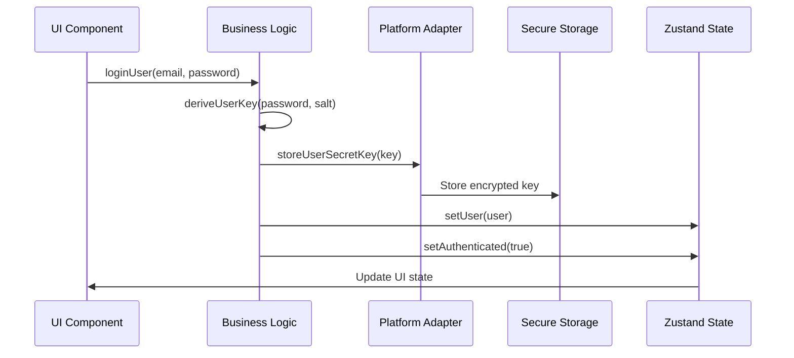
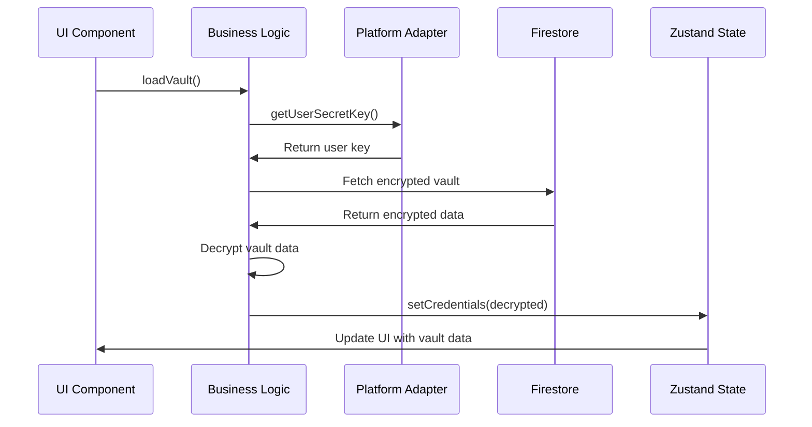
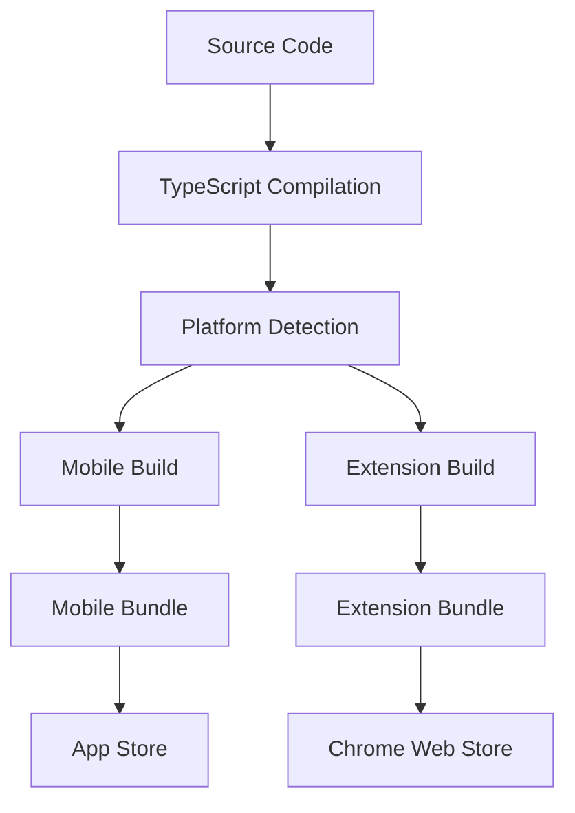
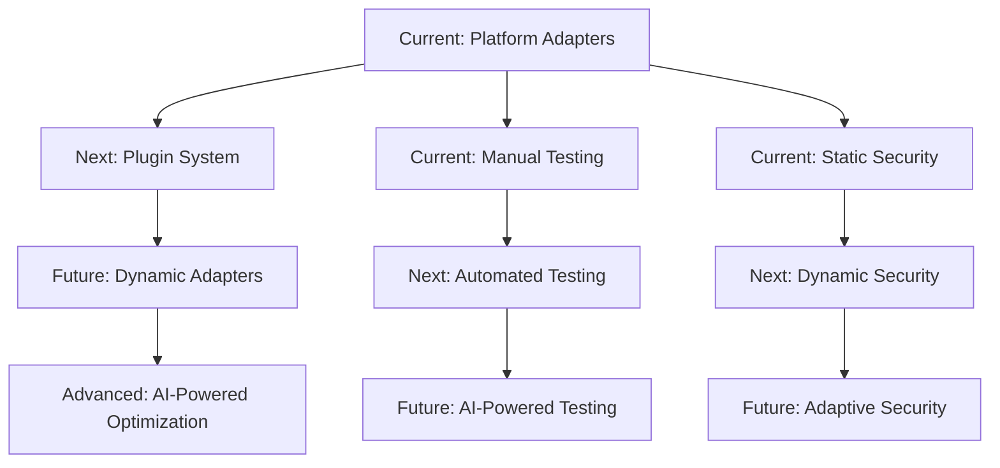

# SimpliPass Architecture Documentation

## Overview

SimpliPass is a cross-platform password manager that shares code between mobile (React Native) and browser extension (Chrome Extension) platforms. The architecture is designed to maximize code reuse while maintaining platform-specific optimizations.

## High-Level Architecture

```
┌─────────────────────────────────────────────────────────────────┐
│                        SimpliPass                              │
├─────────────────────────────────────────────────────────────────┤
│  ┌─────────────┐  ┌─────────────┐  ┌─────────────┐          │
│  │   Mobile    │  │  Extension  │  │    Web      │          │
│  │   Platform  │  │  Platform   │  │   Platform  │          │
│  └─────────────┘  └─────────────┘  └─────────────┘          │
├─────────────────────────────────────────────────────────────────┤
│                    Shared Packages                              │
│  ┌─────────────┐  ┌─────────────┐  ┌─────────────┐          │
│  │     App     │  │    Core     │  │   Shared    │          │
│  │   (UI)      │  │  (Logic)    │  │  (Types)    │          │
│  └─────────────┘  └─────────────┘  └─────────────┘          │
└─────────────────────────────────────────────────────────────────┘
```

## Package Structure

```
packages/
├── app/                    # Shared UI Components
│   ├── components/         # React Native components
│   ├── screens/           # Screen components
│   └── core/              # App-specific logic
│       ├── adapters/      # Platform adapter interface
│       ├── logic/         # Business logic
│       ├── states/        # Zustand stores
│       └── types/         # Type definitions
├── mobile/                # Mobile-specific code
│   ├── adapters/          # Mobile platform adapter
│   ├── services/          # Mobile services
│   └── utils/             # Mobile utilities
├── extension/             # Extension-specific code
│   ├── adapters/          # Extension platform adapter
│   ├── background/        # Background script
│   ├── content/           # Content scripts
│   └── utils/             # Extension utilities
└── shared/                # Shared utilities
    ├── constants/         # Shared constants
    ├── types/             # Shared types
    └── utils/             # Shared utilities
```

## Data Flow Architecture

### Authentication Flow



### Vault Loading Flow



## Platform Adapter Pattern

### Interface Definition

```typescript
interface PlatformAdapter {
  // Storage Operations
  getUserSecretKey(): Promise<string | null>;
  storeUserSecretKey(key: string): Promise<void>;
  deleteUserSecretKey(): Promise<void>;
  
  // Platform Information
  getPlatformName(): 'mobile' | 'extension';
  supportsBiometric(): boolean;
  supportsOfflineVault(): boolean;
  
  // Authentication
  authenticateWithBiometrics?(): Promise<boolean>;
  isBiometricAvailable?(): Promise<boolean>;
  
  // Clipboard
  copyToClipboard(text: string): Promise<void>;
  getFromClipboard(): Promise<string>;
  
  // Session Management
  clearSession(): Promise<void>;
  getDeviceFingerprint(): Promise<string>;
  
  // Network
  isOnline(): Promise<boolean>;
  getNetworkStatus(): Promise<'online' | 'offline' | 'unknown'>;
}
```

### Platform Implementations

#### Mobile Platform Adapter

```typescript
class MobilePlatformAdapter implements PlatformAdapter {
  async getUserSecretKey() {
    return SecureStore.getItemAsync('userSecretKey');
  }
  
  async storeUserSecretKey(key: string) {
    return SecureStore.setItemAsync('userSecretKey', key);
  }
  
  async authenticateWithBiometrics() {
    return LocalAuthentication.authenticateAsync({
      promptMessage: 'Authenticate to access SimpliPass',
    });
  }
  
  getPlatformName() {
    return 'mobile';
  }
  
  supportsBiometric() {
    return true;
  }
  
  supportsOfflineVault() {
    return false; // Mobile always fetches from Firestore
  }
}
```

#### Extension Platform Adapter

```typescript
class ExtensionPlatformAdapter implements PlatformAdapter {
  async getUserSecretKey() {
    const result = await chrome.storage.local.get('userSecretKey');
    return this.decryptFromStorage(result.userSecretKey);
  }
  
  async storeUserSecretKey(key: string) {
    const encrypted = await this.encryptForStorage(key);
    return chrome.storage.local.set({ userSecretKey: encrypted });
  }
  
  async getEncryptedVault() {
    return chrome.storage.local.get('encryptedVault');
  }
  
  getPlatformName() {
    return 'extension';
  }
  
  supportsBiometric() {
    return false; // Extensions don't support biometrics
  }
  
  supportsOfflineVault() {
    return true; // Extensions have local encrypted vault
  }
}
```

## State Management Architecture

### Zustand Store Structure

```typescript
// Auth State
interface AuthStore {
  user: User | null;
  session: UserSession | null;
  isAuthenticated: boolean;
  isLoading: boolean;
  error: string | null;
  
  // Actions
  setUser: (user: User) => void;
  setSession: (session: UserSession) => void;
  setAuthenticated: (authenticated: boolean) => void;
  setLoading: (loading: boolean) => void;
  setError: (error: string | null) => void;
  clearAuth: () => void;
}

// Credentials State
interface CredentialsStore {
  credentials: Credential[];
  searchQuery: string;
  filters: SearchFilters;
  isLoading: boolean;
  error: string | null;
  
  // Actions
  setCredentials: (credentials: Credential[]) => void;
  addCredential: (credential: Credential) => void;
  updateCredential: (id: string, updates: Partial<Credential>) => void;
  deleteCredential: (id: string) => void;
  setSearchQuery: (query: string) => void;
  setFilters: (filters: SearchFilters) => void;
}
```

### State Synchronization

```typescript
// State synchronization utility
export const syncAllStates = async (data: {
  credentials?: Credential[];
  bankCards?: BankCard[];
  secureNotes?: SecureNote[];
  user?: User;
  auth?: AuthState;
}) => {
  const errors: string[] = [];
  const updatedStates: string[] = [];
  
  // Sync credentials
  if (data.credentials) {
    try {
      useCredentialsStore.getState().setCredentials(data.credentials);
      updatedStates.push('credentials');
    } catch (error) {
      errors.push(`Failed to sync credentials: ${error}`);
    }
  }
  
  // Sync other states...
  
  return {
    success: errors.length === 0,
    errors,
    updatedStates,
  };
};
```

## Security Architecture

### Encryption Layers

```
┌─────────────────────────────────────────────────────────────┐
│                    Security Layers                         │
├─────────────────────────────────────────────────────────────┤
│  ┌─────────────────┐  ┌─────────────────┐                │
│  │   Application   │  │   Transport     │                │
│  │   Encryption    │  │   Encryption    │                │
│  │   (AES-256)     │  │   (TLS 1.3)    │                │
│  └─────────────────┘  └─────────────────┘                │
├─────────────────────────────────────────────────────────────┤
│  ┌─────────────────┐  ┌─────────────────┐                │
│  │   Platform      │  │   Storage       │                │
│  │   Security      │  │   Encryption    │                │
│  │   (Keychain)    │  │   (Device Key)  │                │
│  └─────────────────┘  └─────────────────┘                │
└─────────────────────────────────────────────────────────────┘
```

### Key Derivation

```typescript
// PBKDF2 key derivation
async function deriveUserKey(password: string, salt: string): Promise<string> {
  const encoder = new TextEncoder();
  const passwordBuffer = encoder.encode(password);
  const saltBuffer = encoder.encode(salt);
  
  const key = await crypto.subtle.importKey(
    'raw',
    passwordBuffer,
    { name: 'PBKDF2' },
    false,
    ['deriveBits']
  );
  
  const derivedBits = await crypto.subtle.deriveBits(
    {
      name: 'PBKDF2',
      salt: saltBuffer,
      iterations: 100000,
      hash: 'SHA-256',
    },
    key,
    256
  );
  
  return btoa(String.fromCharCode(...new Uint8Array(derivedBits)));
}
```

## Error Handling Architecture

### Error Hierarchy

```typescript
// Base platform error
export class PlatformError extends Error {
  constructor(
    message: string,
    public code: string,
    public platform: string,
    public originalError?: Error
  ) {
    super(message);
    this.name = 'PlatformError';
  }
}

// Specific error types
export class BiometricError extends PlatformError {
  constructor(message: string, platform: string, originalError?: Error) {
    super(message, 'BIOMETRIC_ERROR', platform, originalError);
    this.name = 'BiometricError';
  }
}

export class StorageError extends PlatformError {
  constructor(message: string, platform: string, originalError?: Error) {
    super(message, 'STORAGE_ERROR', platform, originalError);
    this.name = 'StorageError';
  }
}

export class NetworkError extends PlatformError {
  constructor(message: string, platform: string, originalError?: Error) {
    super(message, 'NETWORK_ERROR', platform, originalError);
    this.name = 'NetworkError';
  }
}
```

### Error Handling Flow

```typescript
// Error boundary pattern
export function withErrorHandling<T>(
  operation: () => Promise<T>,
  errorHandler: (error: PlatformError) => void
): Promise<T> {
  return operation().catch((error) => {
    const platformError = new PlatformError(
      error.message,
      'UNKNOWN_ERROR',
      'unknown',
      error
    );
    errorHandler(platformError);
    throw platformError;
  });
}
```

## Testing Architecture

### Test Structure

```
tests/
├── unit/                    # Unit tests
│   ├── logic/              # Business logic tests
│   ├── adapters/           # Adapter tests
│   └── utils/              # Utility tests
├── integration/             # Integration tests
│   ├── auth/               # Authentication flow tests
│   ├── vault/              # Vault operations tests
│   └── platform/           # Platform-specific tests
└── e2e/                    # End-to-end tests
    ├── mobile/             # Mobile E2E tests
    └── extension/          # Extension E2E tests
```

### Mock Strategy

```typescript
// Platform adapter mocks
const createMockPlatformAdapter = (overrides: Partial<PlatformAdapter>) => {
  return {
    getUserSecretKey: jest.fn(() => Promise.resolve('mock-key')),
    storeUserSecretKey: jest.fn(() => Promise.resolve()),
    deleteUserSecretKey: jest.fn(() => Promise.resolve()),
    getPlatformName: jest.fn(() => 'mobile'),
    supportsBiometric: jest.fn(() => true),
    supportsOfflineVault: jest.fn(() => false),
    ...overrides,
  } as PlatformAdapter;
};

// State mocks
const createMockAuthStore = () => ({
  user: null,
  session: null,
  isAuthenticated: false,
  isLoading: false,
  error: null,
  setUser: jest.fn(),
  setSession: jest.fn(),
  setAuthenticated: jest.fn(),
  setLoading: jest.fn(),
  setError: jest.fn(),
  clearAuth: jest.fn(),
});
```

## Performance Considerations

### Memory Management

```typescript
// Automatic memory clearing
export const clearSessionMemory = async () => {
  // Clear all Zustand stores
  useAuthStore.getState().clearAuth();
  useCredentialsStore.getState().setCredentials([]);
  useBankCardsStore.getState().setBankCards([]);
  useSecureNotesStore.getState().setSecureNotes([]);
  
  // Clear platform-specific memory
  const adapter = await getPlatformAdapter();
  await adapter.clearSession();
};
```

### Lazy Loading

```typescript
// Lazy load platform adapters
export const getPlatformAdapter = async (): Promise<PlatformAdapter> => {
  if (!platformAdapter) {
    const platform = detectPlatform();
    
    if (platform === 'mobile') {
      const { MobilePlatformAdapter } = await import('@mobile/adapters/platform.adapter');
      platformAdapter = new MobilePlatformAdapter();
    } else {
      const { ExtensionPlatformAdapter } = await import('@extension/adapters/platform.adapter');
      platformAdapter = new ExtensionPlatformAdapter();
    }
  }
  
  return platformAdapter;
};
```

## Deployment Architecture

### Build Process



### Platform-Specific Builds

```json
{
  "scripts": {
    "build:mobile": "expo build",
    "build:extension": "vite build",
    "build:all": "npm run build:mobile && npm run build:extension",
    "test:mobile": "jest --config jest.mobile.config.js",
    "test:extension": "jest --config jest.extension.config.js",
    "test:all": "npm run test:mobile && npm run test:extension"
  }
}
```

## Future Architecture Enhancements

### Planned Improvements

1. **Plugin System**: Allow third-party platform adapters
2. **Dynamic Feature Detection**: Runtime platform capability detection
3. **Performance Monitoring**: Cross-platform performance metrics
4. **Security Auditing**: Automated security compliance checks
5. **Offline Sync**: Enhanced offline synchronization
6. **Cross-Platform Migration**: Seamless data migration between platforms

### Architecture Evolution



## Conclusion

The SimpliPass architecture provides a robust foundation for cross-platform password management while maintaining security, performance, and developer experience. The platform adapter pattern ensures code reuse while allowing platform-specific optimizations, and the comprehensive testing strategy ensures reliability across all platforms. 